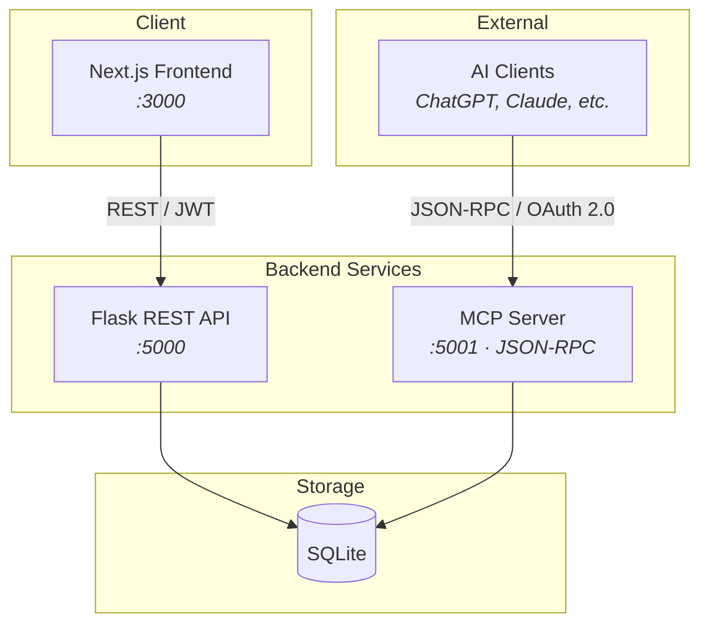
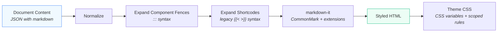
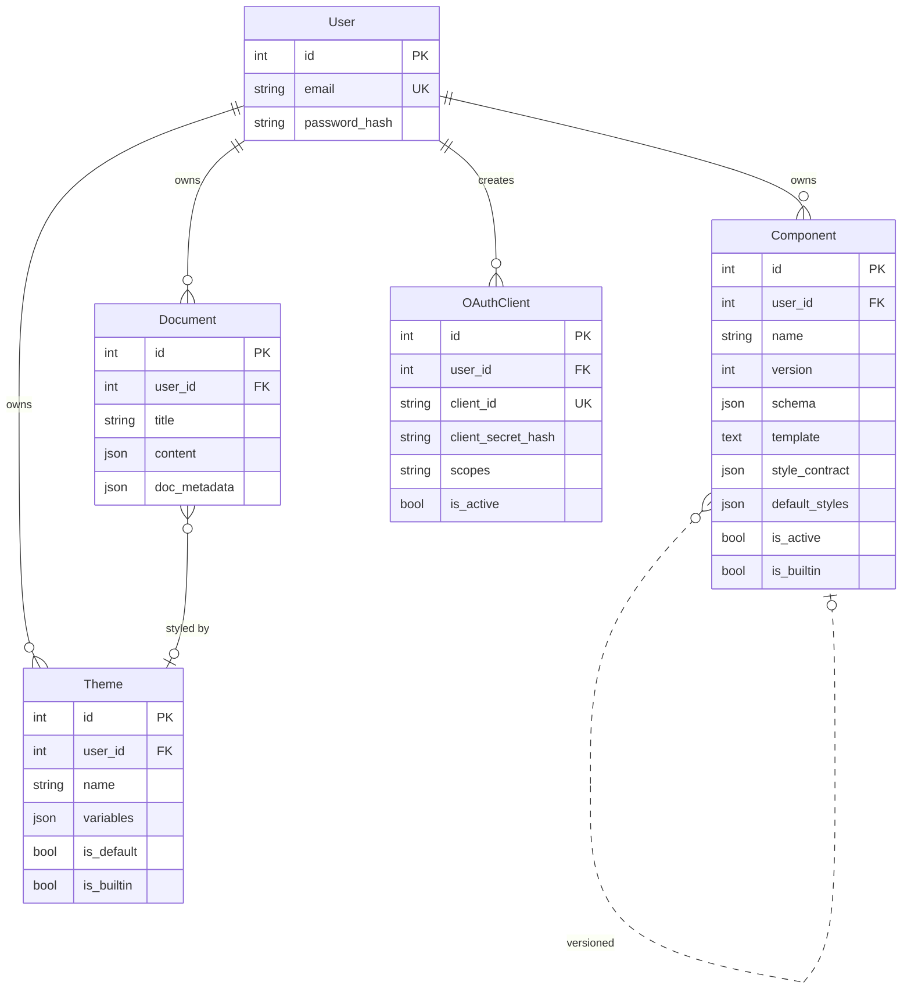
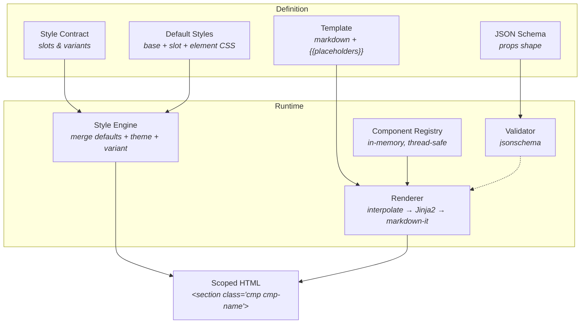
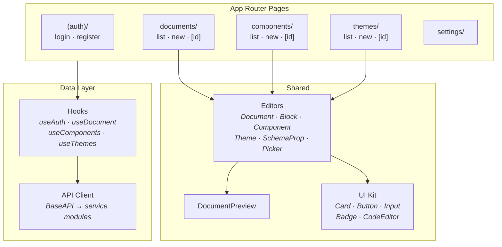
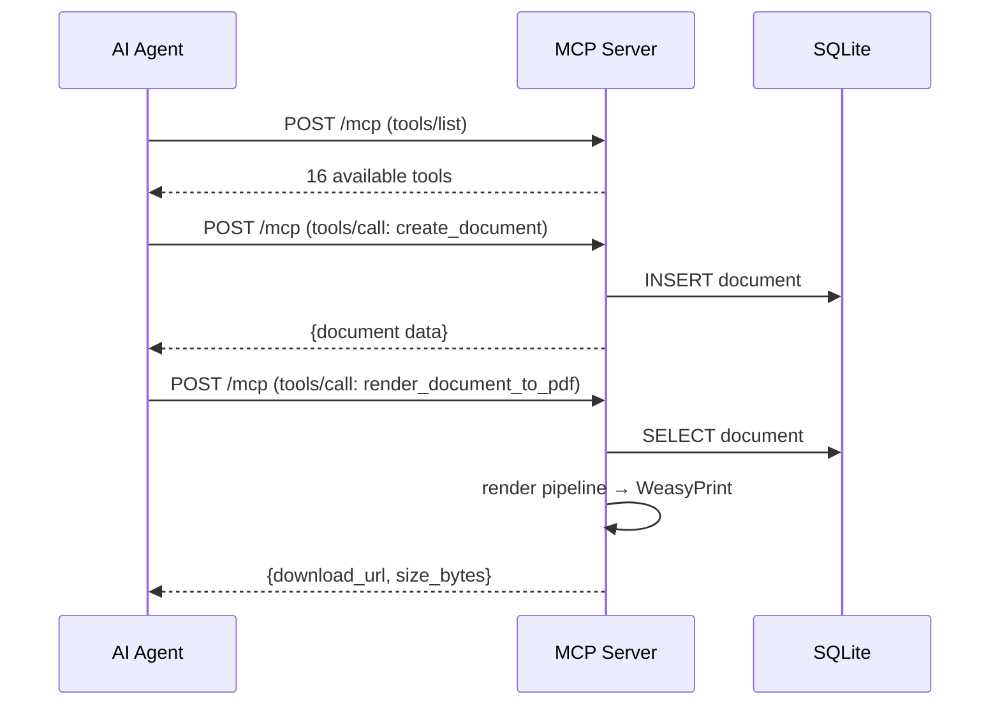

# Docsly — Architecture

Docsly is a **markdown-first composable document builder**. You write markdown, drop in custom components with `:::` fences, pick a theme — and get clean, styled HTML or PDF out the other side.

This document explains how the system is structured, why certain decisions were made, and where the trade-offs lie.

---

## System Overview

Three services, one database, zero complexity tax.



| Service | Role | Port |
|---------|------|------|
| **Frontend** | Next.js App Router — editor, preview, theme designer | `3000` |
| **Backend API** | Flask — CRUD, rendering, auth | `5000` |
| **MCP Server** | Flask — Model Context Protocol for AI agents | `5001` |
| **SQLite** | Single-file database, shared via Docker volume | — |

All three services run in Docker Compose. `make dev` brings up everything.

---

## Rendering Pipeline

The core of Docsly. Markdown goes in, styled HTML comes out. Every render follows the same path — whether it's a full document, a single block preview, or an MCP tool call.



### What happens at each step

1. **Normalize** — Extract `markdown` string from the content JSON. If content uses the legacy `blocks` array format, convert each block to its `:::` fence equivalent.

2. **Expand Component Fences** — Walk the markdown line-by-line. When a `:::component-name` fence is found, parse its props, recursively expand any nested fences, and render it through the component registry. Core layout primitives (`row`, `column`, `table`) are handled inline; custom components go through Jinja2/template rendering.

3. **Expand Shortcodes** — Handle `...` enclosed shortcodes and `` self-closing shortcodes. Same layout primitives, alternate syntax.

4. **Markdown-it** — CommonMark parser with `table`, `strikethrough`, and `container` plugins. HTML passthrough enabled so rendered component output survives the parse.

5. **Theme CSS** — CSS custom properties from the theme's `variables` map, plus scoped element style rules (e.g., `h1` font-size, table borders). Everything scoped under `.docsly-content`.

### Safety

- Component nesting capped at **8 levels** — prevents infinite recursion
- Circular component references detected and reported as error blocks
- Templates execute in a **Jinja2 sandbox** — no filesystem access, no imports

---

## Data Model

Five domain models. No over-abstraction.



### Key points

- **Documents** store content as JSON with a `markdown` field — the single source of truth. No separate block table, no AST persistence.
- **Components** are immutable-per-version. Updating a component creates a new version and deactivates the old one. Documents reference components by name (+ optional version pin).
- **Themes** hold CSS custom properties and scoped element styles in a single `variables` JSON blob. The special `__element_styles` key maps selectors to declarations.
- **User scoping** — every model has an optional `user_id`. Builtins (`is_builtin=true`) are visible to all users; user-created resources are private.

---

## Component System

Components are the extension point. Users define a **JSON Schema** for props, a **template** (markdown + Jinja2), and an optional **style contract**.



### Component fence syntax

```markdown
:::proposal-cover v=1
client_name="Acme Corp"
project="Website Redesign"
:::
```

This is the only syntax users need to learn. The renderer handles everything else.

### Registry

The component registry is an **in-memory lookup table** rebuilt from the database on startup and after any component mutation. Lookups are `O(1)` by `(user_id, name, version)`. User-scoped components shadow builtins of the same name.

### Style layering

Styles are composed in priority order:

```
Component default_styles  →  Theme __component_styles override  →  Variant selection
```

The style engine generates scoped CSS per component instance, targeting `.cmp-{name}` class selectors. Slots and element selectors are all scoped — no style bleed between components.

---

## Frontend Architecture

Standard Next.js App Router layout. No state management library — just hooks and the API layer.



### API client

A single `BaseAPI` class handles auth token injection, error handling, and 401 redirects. Service modules (`auth`, `documents`, `components`, `themes`, `oauth`) extend it. No fetch wrappers, no axios, no generated clients.

---

## MCP Integration

The MCP server exposes Docsly's capabilities as **tools** that AI agents can call via JSON-RPC 2.0.



### Auth model

Two auth paths, both valid:

- **API Key** — `X-API-Key` or `Bearer` header with the `MCP_API_KEY` env var. Simple, for local/trusted use.
- **OAuth 2.0** — Full authorization code flow with PKCE. Supports `authorization_code`, `client_credentials`, and `refresh_token` grants. User-scoped — tools only access the authenticated user's resources.

Discovery endpoints: `/.well-known/oauth-authorization-server`, `/.well-known/oauth-protected-resource`, `/.well-known/mcp`.

### Available tools

Documents: `list`, `get`, `create`, `update`, `delete`
Components: `list`, `get`, `create`, `preview_template`, `render_instance`
Themes: `list`, `get`, `create`
Rendering: `render_to_html`, `render_to_pdf`, `preview_to_pdf`, `preview_block`
Composition: `compose_document_from_components`

---

## Constraints & Trade-offs

### SQLite — simple, but single-writer

SQLite is the only database. No Postgres, no Redis, no migration framework.

**Why:** One file, zero ops, instant setup. `docker-compose up` and you're running. Schema changes are handled with runtime patching (`ALTER TABLE` on startup) instead of a migration tool.

**Trade-off:** Single-writer means no concurrent writes under heavy load. Fine for personal/small-team use. Not fine if you need multi-region deployment.

### No real-time collaboration

Documents are not CRDT-backed. There's no WebSocket sync, no operational transforms. If two users edit the same document, last-write-wins.

**Why:** Docsly is a document *builder*, not a collaborative editor. The complexity of real-time sync (OT/CRDT, presence, conflict resolution) would dwarf the rest of the codebase for a feature most users don't need.

### In-memory component registry

The registry is rebuilt from the DB on every startup and after mutations. It's fast (`O(1)` lookups, thread-safe with `RLock`) but lives in a single process.

**Trade-off:** If you scale to multiple backend workers, each has its own registry copy. A component created through one worker won't be visible to another until restart. Solvable with pub/sub invalidation if needed — but hasn't been needed.

### Markdown as source of truth

Documents are stored as markdown strings, not as an AST or block tree. The `:::` fence syntax *is* the component serialization format.

**Why:** Markdown is portable, diffable, and human-readable. Users can copy-paste document content, version it in git, or edit it in any text editor. No proprietary format lock-in.

**Trade-off:** Structural operations (reorder blocks, extract sections) require string manipulation rather than tree operations. The `_block_to_markdown` / `_normalize_document_content` functions bridge this gap for the legacy blocks format.

### Jinja2 sandbox — safe, but limited

Component templates run in `SandboxedEnvironment`. No filesystem access, no arbitrary Python execution.

**Trade-off:** You can't write components that fetch external data, run queries, or do complex logic. Components are purely presentational: data in → HTML out. This is intentional — it keeps rendering fast, deterministic, and safe for user-submitted templates.

### MCP server as a separate process

The MCP server is a separate Flask app that imports `create_app()` from the main backend. It shares the database but has its own auth system (OAuth 2.0).

**Why:** MCP has different auth requirements (long-lived tokens for AI agents vs short-lived JWTs for browser sessions). Running it as a separate service keeps concerns clean and allows independent scaling/deployment.

**Trade-off:** Two Flask processes sharing one SQLite file. Works fine with WAL mode and low concurrency.

### No frontend state management library

React hooks + fetch. No Redux, no Zustand, no React Query.

**Why:** The data flow is straightforward — pages fetch what they need, editors submit changes. Adding a state management layer would increase bundle size and cognitive overhead for no measurable benefit at this scale.

---

## Project Structure

```
Docsly/
├── backend/
│   ├── app/
│   │   ├── __init__.py          # App factory, seed data, schema patching
│   │   ├── config.py            # Environment-based config
│   │   ├── extensions.py        # SQLAlchemy, JWT manager
│   │   ├── models/
│   │   │   ├── user.py          # User with password hashing
│   │   │   ├── document.py      # Document with JSON content
│   │   │   ├── component.py     # Versioned component definitions
│   │   │   ├── theme.py         # Theme with CSS variables
│   │   │   └── oauth.py         # OAuth client, codes, tokens
│   │   ├── routes/
│   │   │   ├── auth.py          # Register, login, refresh
│   │   │   ├── documents.py     # Document CRUD + render
│   │   │   ├── components.py    # Component CRUD
│   │   │   ├── themes.py        # Theme CRUD
│   │   │   └── oauth_clients.py # OAuth client management
│   │   └── services/
│   │       ├── renderer.py      # Core rendering pipeline
│   │       ├── markdown_engine.py  # markdown-it wrapper
│   │       ├── style_engine.py  # Component CSS composition
│   │       ├── pdf_engine.py    # WeasyPrint HTML → PDF
│   │       ├── component_registry.py  # In-memory lookup
│   │       └── validator.py     # JSON Schema validation
│   └── mcp_server.py           # MCP JSON-RPC server
├── frontend/
│   └── src/
│       ├── app/                 # Next.js App Router pages
│       ├── components/
│       │   ├── ui/              # Shared UI primitives
│       │   ├── editor/          # Document & component editors
│       │   └── preview/         # Live document preview
│       ├── hooks/               # Data-fetching hooks
│       ├── lib/api/             # API client + service modules
│       └── types/               # TypeScript types
├── docker-compose.yml
├── Makefile
└── ARCHITECTURE.md              # You are here
```
